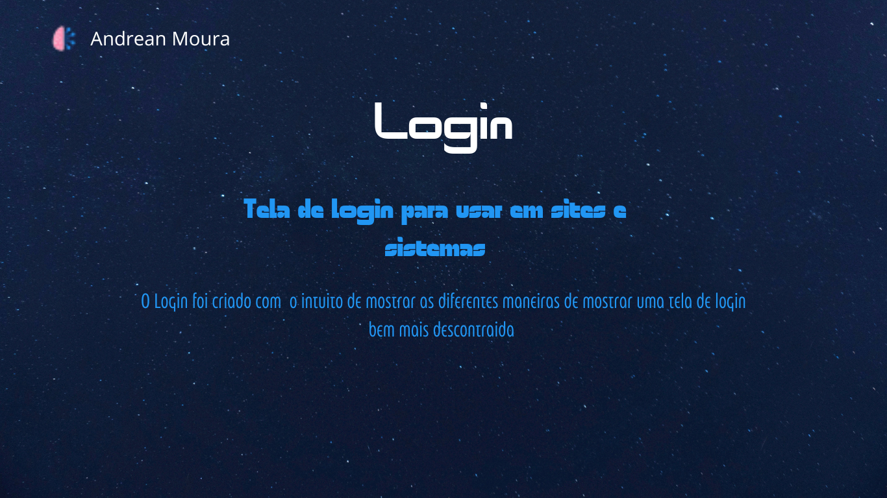

<h1 align="center"> Login</h1>

Programa exclusivo, Desenvolvido para tecnologias WEB.  

  <a href="#-tecnologias">Tecnologias</a>&nbsp;&nbsp;&nbsp;|&nbsp;&nbsp;&nbsp;
  <a href="#-projeto">Projeto</a>&nbsp;&nbsp;&nbsp;|&nbsp;&nbsp;&nbsp;
  <a href="#-layout">Layout</a>&nbsp;&nbsp;&nbsp;|&nbsp;&nbsp;&nbsp;
  <a href="#memo-licença">Licença</a>

  

 

  

## 🚀 Tecnologias

Esse projeto foi desenvolvido com as seguintes tecnologias:

- HTML e CSS
- Git e Github
- Figma

## 💻 Projeto

O Login  tem intuito de mostrar como diferentes paginas pode ser modificadas de acordo com layout feito por designs e tambem como os acessos aos usuarios podem ser bem mas interessantes.

- [Acesse o projeto finalizado, online](tela-login-simples.vercel.app)

## 🔖 Layout

Criado por Andrean Moura

## Dev
Feito por Andrean Moura ♥ 